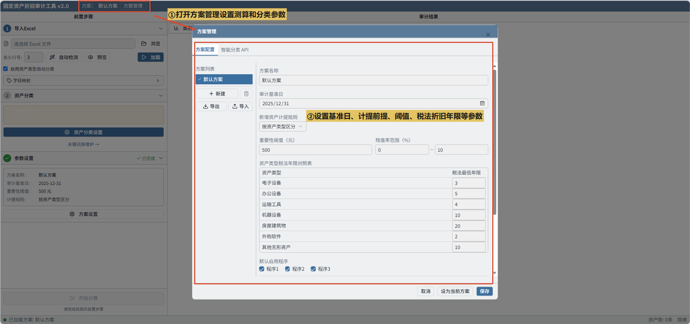
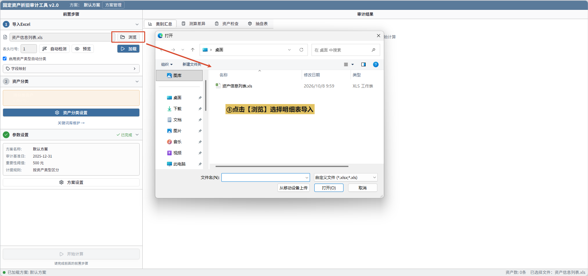
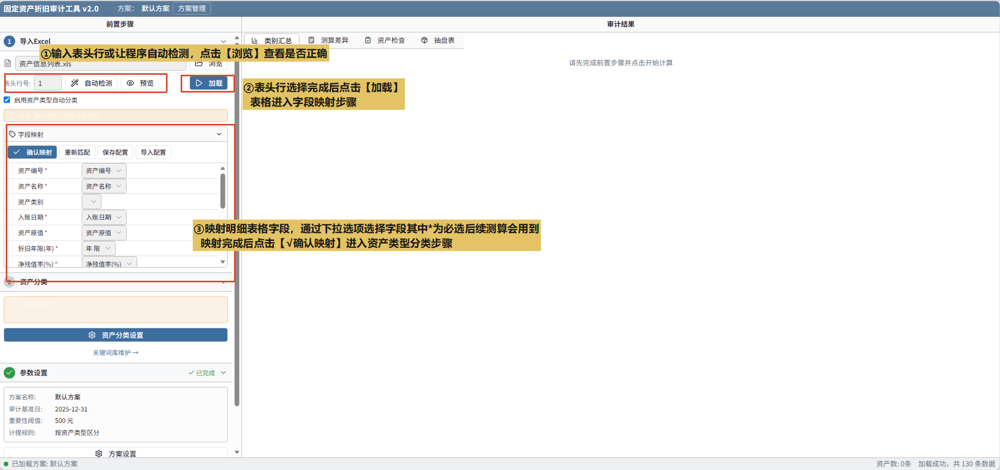
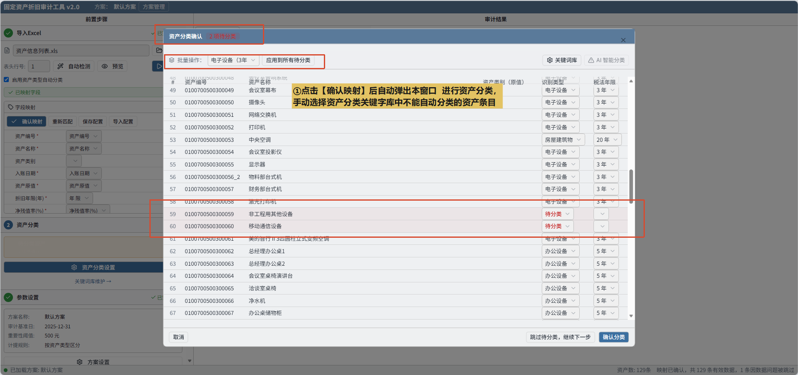
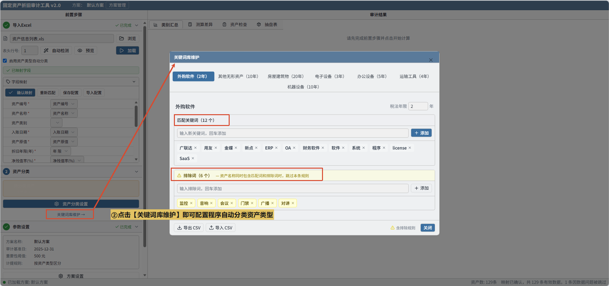
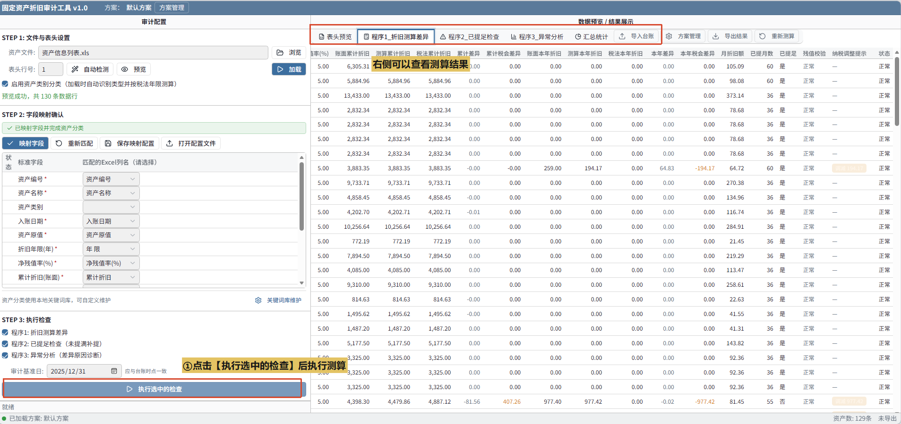
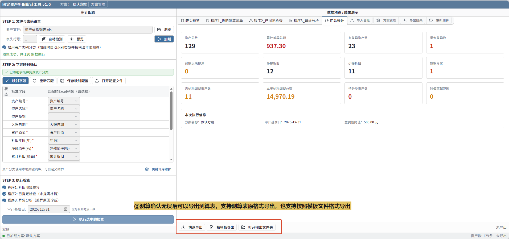
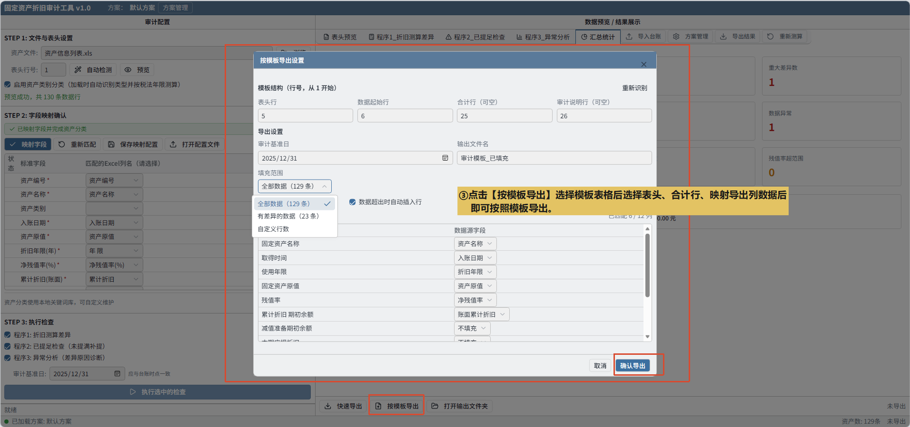

# 固定资产折旧审计工具

导入企业资产管理系统导出的明细表后，程序自动按照预设方案执行测算程序，标注异常并最终按规定格式表格导出，生成审计底稿。

## 主要功能

- 测算资产折旧金额正确性
- 比对资产折旧税会差异 确定纳税调整

## 环境要求

- html 打开即用

## 使用步骤

### 1. 确认测算参数，导入资产明细表

①点击【方案管理】配置测算和分类参数

②点击【浏览】选择明细表导入（尽可能保证信息齐全，企业资产管理系统导出明细表即可）

### 2. 选择表头行并映射明细表字段

①选择表头行，可手动输入表头行行数或者自动检测让程序自动识别，【浏览】按钮能查看表头行选择是否正确

②映射明细表字段，将明细表列数据对应到后续测算参数，映射完成后点击【确认映射】进入资产类别分类

### 3. 资产类别分类

①资产类别步骤是进行税会差异测算的前置程序，通过分类关键字库分类资产类别与【方案管理】中预设好的税收口径资产折旧年限比较，发现税会差异。

②【关键词库维护】能进入各个资产类型关键字库编辑的窗口

### 4. 折旧测算和导出测算表

①点击【执行选中的检查】执行测算程序，测算结果会从右侧窗口显示结果，可浏览测算结果

②选择导出模式：快速导出（直接导出测算表）、按模板导出（按照模板表格导出）配置好后即可导出

